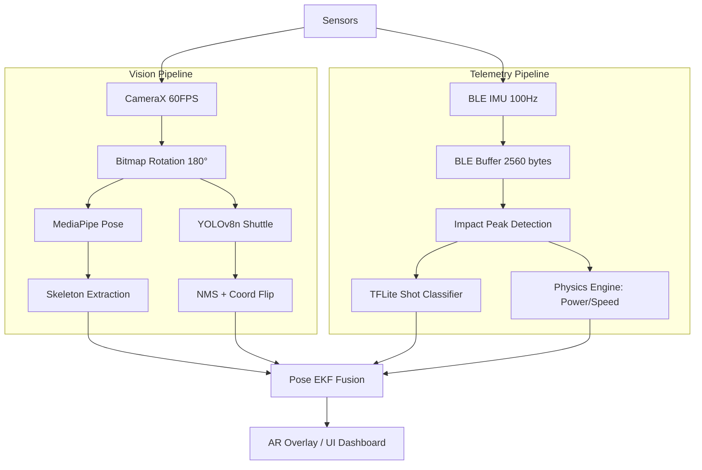
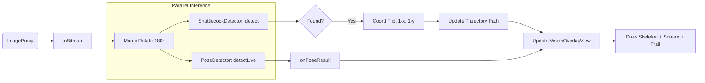
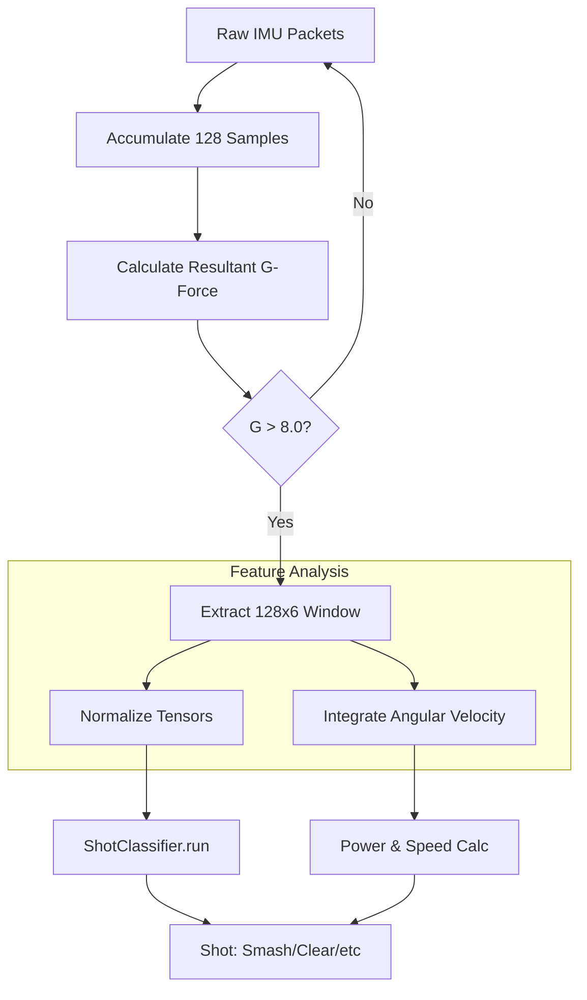
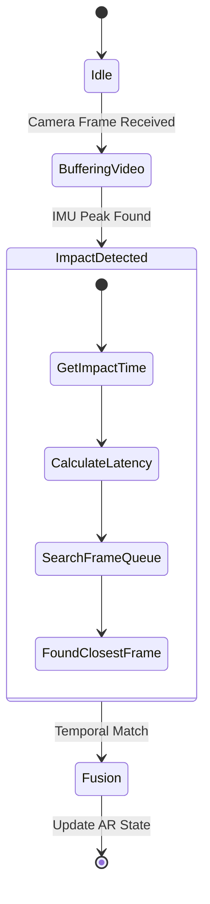
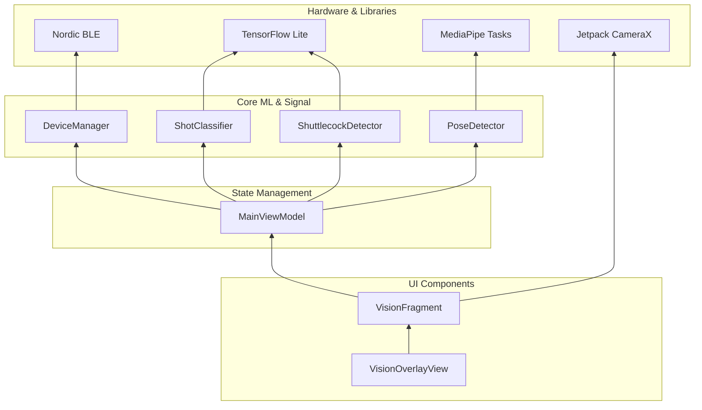

# Badminton AI System: Logic & Algorithm Flow Diagrams

This document visualizes the internal logic, algorithmic steps, and dependency chains of the Badminton AI Analysis system using Mermaid diagrams.

---

## 1. High-Level System Architecture
The system operates as a synchronized dual-stream processor: one for high-frequency IMU telemetry and one for real-time Computer Vision.

---

## 2. Vision Pipeline Algorithm (`VisionFragment`)
This diagram detail the per-frame processing logic used for AR tracking.

---

## 3. IMU Processing & Impact Algorithm
How the system identifies a badminton shot from raw accelerometer and gyroscope data.

---

## 4. Pose EKF Fusion Logic
The temporal synchronization between asynchronous video and telemetry.

---

## 5. Dependency & Module Hierarchy
Mapping how different code components depend on each other.

---

## 6. Mathematical Algorithms

### A. Shuttlecock Speed Estimation
$$Distance = \sqrt{(x_2 - x_1)^2 + (y_2 - y_1)^2}$$
$$Velocity = \frac{Distance \times ScaleFactor}{\Delta t}$$

### B. Impact Normalization (IMU)
$$InputTensor = \frac{RawValue - Mean}{StandardDeviation}$$

### C. Coordinate Mapping (180° AR Fix)
$$x_{render} = (1.0 - x_{raw}) \times ViewWidth$$
$$y_{render} = (1.0 - y_{raw}) \times ViewHeight$$
